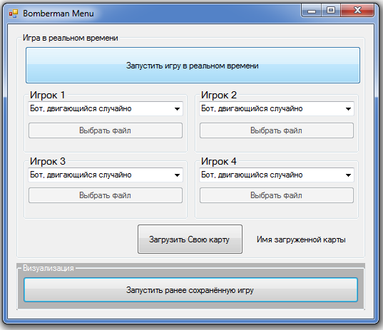

# 1. Краткое описание соревнований
Используя свои навыки программирования, создайте своего Бота (игровую стратегию), который будет биться с Ботами других участников в предлагаемом игровом мире.

 **Борьба за Железный трон в Королевской Гавани не прекращается ни на секунду. Чтобы восстановить свою власть в столице, королева Серсея пошла на крайние меры – взорвала главный храм, Великую септу Бейлора. Это заставило её соперников перейти к решительным действиям: они начали устраивать подрывы по всему городу. В ответ на столь наглые действия Серсея приказала уничтожить целые районы, где могут скрываться ее враги, и пообещала оплатить работу золотом. И так небо над Королевской гаванью затянулось дымом пожаров.
Вы управляете одним из подрывников Серсеи. Ваша задача – уничтожить как можно больше построек и собрать как можно больше снаряжения. В каждый район было послано до 4 подрывников с приказом уничтожать любого, кто встретится на пути.**

Соревнование проводится на специально разработанной [платформе](http://195.133.48.168/), на которой участнки могут Отправить своё решение, 
Создать свои игры с выбранными участниками (**Песочница**), узнать результат симуляции, проанализировать и улучшить свою Стратегию (используя возможность Визуализации прошедшего боя) и снова отправить свою стратегию. 

# 2. Описание игрового мира

Борьба за Железный трон в Королевской Гавани не прекращается ни на секунду. Чтобы восстановить свою власть в столице, королева Серсея пошла на крайние меры – взорвала главный храм, Великую септу Бейлора. Это заставило её соперников перейти к решительным действиям: они начали устраивать подрывы по всему городу. В ответ на столь наглые действия Серсея приказала уничтожить целые районы, где могут скрываться ее враги, и пообещала оплатить работу золотом. И так небо над Королевской гаванью затянулось дымом пожаров.

Вы управляете одним из подрывников Серсеи. Ваша задача – уничтожить как можно больше построек и собрать как можно больше снаряжения. В каждый район было послано до 4 подрывников с приказом уничтожать любого, кто встретится на пути.

Территория, на которую вас послали, представляет собой поле 15х15 клеток. 
В каждой клетке может находиться только один объект:
* [Подрывник](#player)
* [Бомба](#bomb)
* Неразрушимый объект – каменная стена древнего здания
* Разрушимый объект – деревянная городская постройка, в которой может быть спрятаны бонусы.

Время в игровом мире дискретно и единицей времени является Ход. Игра продолжается ограниченное количество ходов.
Игра закачивается в следующих случаях:
* Игрвое время закончилось
* Остался либо один Подрывник, либо ни одного. 

В каждый тик выполняются следующие операции:
* Сервер отправляет данные об игровом мире вашей стратегии
* Она в ответ отправляет Команду - действие, которое должен выполнить ваш Подрывник на следующий тик
* После получения всех команд от стратегий просчитывается новое состоятие игрового мира
* Всё начинается заново до тех пор, пока не настанет Конец игры

Существуют ограничения по количеству потребляемых ресурсов и время работы стратегии:
* 64 мегабайта оперативной памями
* 1 секунда на ожидание ответа от стратегии

Если ваша стратегия падает, то управляемый ею Подрывник будет стоять на месте до конца игры.
Стратегия считается "упавшей", если она:
* закрывается
* перестаёт отправлять данные серверву
* превышает лимиты потребляемых ресурсов или время ожидания ответа

* Если какая-то из стратегий выдаёт некритическое исключение (например, если индекс находился вне границ массива), то в следующий ход ваш Подрывник не двигается.

# 3. Условия Победы и правила начисления Очков 
Внимание! Следущие значения условный характер и могут не совпадать со значениями при проведении соревнований

Игра длится фиксированное число ходов, однако, она завершится раньше, если на карте остался всего один Подрывник.
Очки присваиваются за определенные игровые действия:
* Убийство другого Подрывника - 20 золотых драконов
* Уничтожение постройки - 1 золотой дракон
* Поднятие бонуса - 4 золотых дракона
* Выживание (несколько выживших) - 20 золотых драконов
* Выживание (один выживший) - 40 золотых драконов

**Если два подрывника одновременно убьют третьего, то золото получат оба. 

**Если два подрывника одновременно уничтожат одну городскую постройку, то золото получат оба.

# 4. Игровые объекты
## GameBoard
GameBoard (игровое поле) - представляет собой объект, содержащий всё доступную информацию об игровом мире.
Свойства:

* Ход (Tick) - количество ходов,  прощедщих с начала игры

* [Players](#player) (Подрывникы) - список Подрывников, участвующих в игре.

* [Bombs](#bomb) (Бомбы) - список невзорвавщихся Бомб на поле

* [Bonuses](#bonus) (Бонусы) - список открытых (видимых) Бонусов на поле

* [Lavas](#lava) (Дикий огонь) - список частей Дикого огня на игровом поле

* [XYinfo](#xyinfo) (Информация о клетке) - массив 15х15, элементы которого содержат информацию о клетке:
**Тип постройки в данной клетке или отсутствие построек**
**Какие другие игровые объекты находятся в этой ячейке: игрок, бонус, бомба, части дикого огня*

## Config
Config (Конфигурация игры) - представляет собой класс, содержащий переменные, определяющие различные параметры игрового мира.

Свойства:
* gameTicksMax - максимальное количество ходов, которое длится игра
* bang_start_radius - начальный радиус взрыва Бомб у Подрывников
* player_bombs_count_start - начальное количество Бомб у Подрывников
* lava_livetime - количество ходов, которое горит Дикий огонь
* bomb_live_time - количество ходов до детонации Бомб
* player_kill_points - количество очков за убийство другого Бота
* player_survive_points - количество очков за выживание в игре, при условии, что выжило несколько ботов
* player_cell_destroy_points - количество очков за уничтожение разрушаемых ячеек
* player_win_points - количество очков, начисляемое в случае, когда бот остался один, а остальные погибли
* player_bonus_find_points - количество очков, начисляемое за поднятие бонуса

## Player 
Player (Подрывник) - ваш игровой персонаж, которым управляет ваша стратегия. Он может двигаться по игровому полю и ставить Бомбы.
Подрывник не может зайти на клетку, в которой находится другой Подрывник, Подрывник не могут пройти друг друга "наскозь".

**Команды игроков выполняются поочередно в рандомной последовательности. 

Имеет свойства:

* Name (Имя) - ваше имя, отображаемое в системе  
* X - положение вашего Бота по оси абсцисс 
* Y - положение вашего Бота по оси ординат 
* Health (Здоровье) - количество жизней вашего Бота. Если это значение равно 0 ваш Бот считается погибшим 
* Points (Очки) - количество очков, набранных за игру 
* BombsCount (Боезапас) - количество Бомб, которые Подрывник может ставит подряд без перезарядки. Зависит от количества поднятых бонусов. Поднимать можно неограниченное количество Бонусов 
* BangRadius (Радиус взрыва) - радиус взрыва Бомб, т.е. количество клеток от эпицентра взрыва по X и Y, которое может поразить Бомба 
* ACTION (Действие) - команда, которую стратегия отдаёт вашему Подрывнику на следующий Ход. Доступны команды:

* * **PlayerAction.Wait** - ничего не делать и стоять на месте

* * **PlayerAction.Up, PlayerAction.Down** - сместиться по оси Y

* * **PlayerAction.Left, PlayerAction.Right** - сместиться по оси X

* * **PlayerAction.Bomb** - поставить Бомбу

Функции:
**Play(GameBoard gb)** - Функция, которая вам доступна, и в которой вы пишете свою стратегию. Она принимает на вход объект тип GameBoard, который содержит всю доступную информацию о текущем состоянии игрового поля.
Возвращяет объект тип PlayerAction - действие, которое выполнит Подрывник в следующий Ход.

## Bonus
Bonus (Бонус) - игровой объект, при поднятии которого Подрывник получает различные преимущеста
Свойства:
* X - положение клетки по оси обсцисс
* Y - положение клетки по оси ординат
* Type - тип бонуса:

* * **BonusType.Radius** - Бонус *Запас Дикого огня*. Увеличивает дальность взрыва на 1 клетку по всем 4 направлениям

* * **BonusType.Ammunation** - Бонус *Боезапас*. Увеличивает число бомб, которые можно устанавливать подряд без перезарядки

## Bomb
Bomb (Бомба) - игровой объект, который имеет таймаут, по истечении которого Бомба взрывается и создаёт другие игровые объекты - Дикий огонь (Lava), которые распологаются в форме креста, центром которого будут координаты взорвавшейся Бомбы.
Подрывник не может зайти на клетку, на которой уже стоит Бомба. 

Свойства:
* X - положение клетки по оси обсцисс
* Y - положение клетки по осети ординат
* Bang_radius - радиус взрыва бомбы
* LiveTime - количество ходов до детонации бомбы

## Lava
Lava (Дикий огонь) - игровой объект, который появляется сразу после взрыва бомбы. Распространению дикого огня от взрыва бомбы мешают границы поля, древние здания и городские постройки. Дикий огонь сжигает первое разрушимое здание (CellType.Destructible)на своём пути и не распространяется дальше в том направлении. Также он сохраняется еще целый ход на тех клетках, где разлился, прежде чем погаснуть. Складам бомб и запасам дикого огня взрывы бомб не вредят, поскольку в них соблюдаются правила противопожарной безопасности.

Свойства:

* X - положение клетки по оси обсцисс

* Y - положение клетки по оси ординат

* LiveTime - количество ходов до того момента, как Дикий огонь "потухнет"

## XYinfo
XYinfo (информация о клетке) - класс, которых содержит информацию о том, какие объекты находятся в ячейке.

Свойства:

* Free (свободная клетка) - возвращает *true*, если в этой клетке нет вообще никаких объектов. Возвращяет *false* в ином случае

* Player - Подрывник, который находится в этой клетке. Если Подрывник нет, то возвращает *null*

* Bomb - Бомба, которая находится в этой клетке. Если Бомбы нет, то возвращает *null*

* Lavas - Список частей Дикого огня, которые находятся в этой клетке. В одной ячейке может находится одновременно несколько частей Дикого огня.  Если нет ни одной части Дикого огня, то возвращает *null*

* Bonus - видимый Бонус, который находится в этой клетке. Если Бонуса нет, то возвращает *null*
* Type - тип ячейки:

* * **CellType.None** - свободная клетка без построек

* * **CellType.Destructible** - разрушаемый объект - Древняя постройка. После разрушения меняет свойство *Type* на **CellType.None**. Может хранит внутри себя какой-либо из Бонусов (Склад бомб или Запас Дикого огня).

* * **CellType.Indestructible** - неразрушаемая ячейка Городская стена. Этот объект не может быть разрушен и является препятствием на протяжении всей игры.

# 5. Локальные файлы
Вам предоставляются локальные файлы для возможности написать свою стратегию. 

Файлы разделены на две папки [Визуализатор](#визуализатор) и [Отладчик](#отладчик)

## ВИЗУАЛИЗАТОР
Визуализатор можно использовать для ознакомления с механикой игры BomberMan, а также [создания кастомных карт](#генератор_карт) и [просмотра реплеев](#реплей)
При открытии Бомбермен.exe вам дадут выбрать качество графики, оконный или полноразмерный режим.
Разрешение и качество графики выбирайте на основе производительности своего компьютера.
Рекомендуем не выбирать разрешения меньше 1024/800, т.к. возможны искажения и т.д.

* ## Настройки
Здесь вы найдете настройки, в которых можно указать FPS  - Количество кадров на 1 ход игры.
Если взрывы в игре или боты в реплеях двигаются слишком быстро попробуйте указать FPS больше.
Если игра слишком тормозит, укажите более низкое число. 

* Файл игры - это имя карты в формате txt в  папке PlayMap, на которой вы можете поиграть с друзьями, чтобы составить примерное  представление о игре. Здесь вы можете изменить загружаемую карту.

* Файл Реплея - это Файл формата txt в папке Replays,  который необходим для просмотра реплея (Повтора) игры в Визуализаторе. Его можно получить после Симуляции игры в локальном отладчике, так и при скачивании с сайта.
Здесь вы можете изменить с какого фала загружать реплей.

* ## Играть
Здесь вы можете поиграть в бомбермен на карте самомстоятельно.
## Управление 

**Синий игрок**
Cтрелками / Правый шифт

**Красный игрок**
W S A D / Space

**Желтый игрок**
I K J L / Правый Alt

**Оранжевый игрок**
Стрелками на Numpud / Numpud0

* ## Генератор полей

Здесь вы можете создать свою собственную карту для игры для того, чтобы тренировать своего бота или поиграть с друзьями.

У вас есть белый курсор который перемещается командами:

W Вверх

S вниз

D право

A лево

Так же при имеется несколько горячих клавиш для создания обьектов на поле:
1 Неразрушимый обьект

2 Разрушимый обьект

3 Разрушимый обьект с бонусом "Складом бобм" внутри (зеленого цвета)

4 Разрушимый обьект с бонусом "Запасы дикого огня" внутри (красного цвета)

5 Игрок (Вы можете установить больше 4 игроков, но лишние игроки удалятся при сохранении - вместо них ставятся пустые клетки)

Delete уничтожение обьекта под курсором.

Поле в верхнем левом углу позволяется задать название карты (разрешение писать не надо)
По кнопке Сохранить текущее состояние карты сохраняется в txt файл с указанным названием в папке SaveMaps.

* ## Реплей
При нажатии кнопки Реплей подгружается файл реплея из папки Replays

1 игрок красный 

2 игрок синий

3 игрок Желтый 

4 Игрок оранжевый

При нажатии кнопке Старт ктивируется реплей, при нажатии кнопки Заново - реплей начинается сначала.

На экране во время игры и реплеев вам видны очки игроков, сила их бомб и количество.

##  ОТЛАДЧИК
CGC.exe служит для локальной отладки вашего кода и просмотра игры на нем с ботами.

Для написания своего Кода можно в качестве шаблона использовать файл Example.cs

* ## Игра в реальном времени:
Здесь вы можете:
*  Задать настройки Игроков и выбрать карту для Симуляции

* Загрузка карты
 вы можете выбрать карту на которой играть (Представляет собой txt файл с матрицой 15 на 15(Создать которую можно самостоятельно в Визуализаторе или вручную). Если вы не выбрали карту, то выбирается одна из стандартных случайным образом. Количество игроков на поле определяется картой, на всех стандартных карта по 4 игрока. 

* Настройка Игроков
Для каждого игрока можно выбрать его Тип:
1. "Не использовать этого игрока"
2. "Ждать ручного запуска для отладки"
3. "Загрузить стратегию из файла .cs"
4., 5., 6. - Различные встроенные Бота, действующие согласно свои названиям.

** "Ждать ручного запуска для отладки"
При выборе этого варианта, при запуске игры Отладчик будет ждать, пока вы запустите решение *User_client/User_client.sln*

 * ## Визуализация:
Здесь можно ппосмотреть ранее сохранённую игру, Выбрав файл с именем *Visualizer.json* который можно найти в одной из подпапок папки *Games*, либо *VisualizerJSON.gz*, который можно скачать с сайта.

Так же в папке Games в папках игр хранятся файлы UserCommandsUnity.txt, которые можног использовать для просмотра данной игра на [Визуализаторе](#визуализатор)
В нём можно увидеть все команды всех ботов в течении игры,а так же вы можете редактировать комнады ботов для получения других вариантов игры и проигрывать редактированную версию реплея как "якобы" другую игру.

# 2. Отправка решений
На странице пользователя можно загрузать неограниченное количество исходных кодов Стратегии, но существует таймаут между отправкой. После успешной компиляции ваша загруженная Стратегия автоматически выбирается как основная, но всегда есть возможность выбрать другую вашу Стратегию в качестве основной. Участвовать в играх могут только успешно скомпилированные решения. Если при компиляции возникли Ошибки, то их можно будет просмореть (если ошибка не будет связана с вашей стратегией или вы не знаете как её решить, необходимо обратиться к организаторам).

На данный момент поддерживается только язык программирования **С# (MONO 5.10) .Net Framework 4.0**
Информация о формате загружаемых файлов, пользовательский пакет для написания стратегии и другие необходимые материалы [ТУТ](/cgc_client)

# 3. Создание своей игры
Игры, созданные в Песочнице ни на что не влияют и служат лишь для оценки ваших собственных сил и вашей Стратегиию. 
Чтобы Создать игру необходимо зайти на соответствующую вкладку и выбрать Участников, с которыми Вы бы хотели протестировать свою Стратегию (не более 3). 
Существует ограничение на количество игр - 5 игр одновременно. Старые игры будут удаляться. 
Другие также имеют возможность добавлять вашу основную Стратегию в свои игры. Вы можете просмотреть итоги во вкладке **История всех игр** на странице участника.
Вы можете Скачать данные для визуального воспроизведения соответствующей игры и открыть их в **Локальном симуляторе** Подробнее [Локальным симулятор](/cgc_client/Отладчик/CGC.exe)

